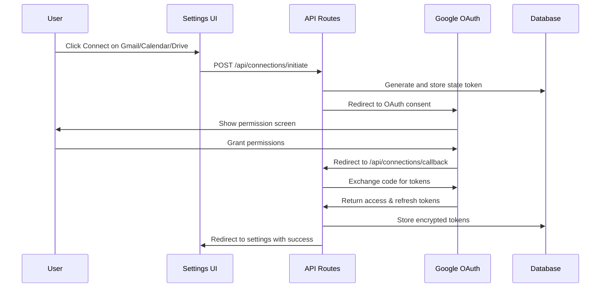

# Google OAuth Connections Implementation

## Overview

Add OAuth 2.0 connections for Gmail, Google Calendar, and Google Drive to provide AI with context from user data. Using read-only scopes and a separate database table for connection management.

## Architecture Flow




## 1. Database Schema

Create new connection table in [`src/db/schemas/connection.ts`](src/db/schemas/connection.ts):

```typescript
export const connection = pgTable("connection", {
  id: integer("id").generatedAlwaysAsIdentity().primaryKey(),
  userId: integer("user_id").notNull().references(() => user.id, { onDelete: "cascade" }),
  provider: text("provider").notNull(), // 'gmail', 'google-calendar', 'google-drive'
  providerAccountId: text("provider_account_id").notNull(), // Google user email
  accessToken: text("access_token").notNull(), // Encrypted
  refreshToken: text("refresh_token"), // Encrypted
  accessTokenExpiresAt: timestamp("access_token_expires_at"),
  scope: text("scope").notNull(),
  status: text("status").default("active").notNull(), // 'active', 'revoked', 'error'
  lastSyncedAt: timestamp("last_synced_at"),
  createdAt: timestamp("created_at").defaultNow().notNull(),
  updatedAt: timestamp("updated_at").$onUpdate(() => new Date()).notNull(),
}, (table) => ({
  connection_userId_provider_idx: uniqueIndex("connection_userId_provider_idx")
    .on(table.userId, table.provider),
}));
```

Add relation to user in [`src/db/schemas/auth.ts`](src/db/schemas/auth.ts):

```typescript
export const userRelations = relations(user, ({ many }) => ({
  // ... existing relations
  connections: many(connection),
}));
```


## 2. API Routes

### `/api/connections/initiate` - POST

Start OAuth flow for a specific provider.**Request body:**

```typescript
{ provider: 'gmail' | 'google-calendar' | 'google-drive' }
```

**Logic:**

- Verify user session
- Generate secure state parameter (store in session/cookie)
- Build Google OAuth URL with appropriate scopes:
- Gmail: `https://www.googleapis.com/auth/gmail.readonly`
- Calendar: `https://www.googleapis.com/auth/calendar.readonly`
- Drive: `https://www.googleapis.com/auth/drive.readonly`
- Return authorization URL

### `/api/connections/callback` - GET

Handle OAuth callback from Google.**Query params:** `code`, `state`, `scope`, `error`**Logic:**

- Verify state parameter
- Exchange authorization code for tokens
- Fetch user info from Google to get email
- Encrypt access & refresh tokens
- Store in database (upsert based on userId + provider)
- Redirect to settings page with success message

### `/api/connections/[provider]` - GET

Get connection status for a provider.**Response:**

```typescript
{ 
  connected: boolean,
  email?: string,
  lastSynced?: Date 
}
```


### `/api/connections/[provider]` - DELETE

Disconnect/revoke a connection.**Logic:**

- Soft delete: Update status to 'revoked'
- Clear tokens from database
- Optionally: Revoke token with Google

## 3. Database Queries

Create [`src/db/queries/connection.ts`](src/db/queries/connection.ts):

```typescript
// Get user connection by provider
export async function getConnection(userId: number, provider: string)

// Create or update connection
export async function upsertConnection(data: ConnectionInsert)

// Get all user connections
export async function getUserConnections(userId: number)

// Soft delete connection
export async function revokeConnection(userId: number, provider: string)

// Get active connections needing token refresh (expires < 5 min)
export async function getExpiringSoonConnections()
```


## 4. Token Management

Create [`src/lib/connections/token-manager.ts`](src/lib/connections/token-manager.ts):**Functions:**

- `encryptToken(token: string): string` - Encrypt using crypto
- `decryptToken(encrypted: string): string` - Decrypt token
- `refreshAccessToken(connection: Connection): Promise<Connection>` - Refresh expired token
- `isTokenExpired(connection: Connection): boolean` - Check if refresh needed

**Encryption:**Use `crypto` module with `AES-256-GCM` and store key in environment variable `ENCRYPTION_KEY`.

## 5. Google API Client

Create [`src/lib/connections/google-client.ts`](src/lib/connections/google-client.ts):**Functions:**

- `getOAuthClient()` - Initialize OAuth2 client with credentials
- `buildAuthUrl(provider, state)` - Build authorization URL with scopes
- `exchangeCodeForTokens(code)` - Exchange auth code for tokens
- `getUserInfo(accessToken)` - Get Google user email
- `revokeToken(token)` - Revoke access token

**Scopes mapping:**

```typescript
const SCOPES = {
  'gmail': ['https://www.googleapis.com/auth/gmail.readonly'],
  'google-calendar': ['https://www.googleapis.com/auth/calendar.readonly'],
  'google-drive': ['https://www.googleapis.com/auth/drive.readonly'],
};
```


## 6. UI Integration

Update [`src/components/connections-card.tsx`](src/components/connections-card.tsx):**Changes:**

- Add `useState` for connection status (loading, connected, email)
- On mount: Fetch connection status for each provider
- `handleConnect`: Call `/api/connections/initiate` and redirect to OAuth URL
- `handleDisconnect`: Call DELETE `/api/connections/[provider]` and refresh state
- Show connected email address when connected
- Show loading spinner during OAuth flow

## 7. Environment Variables

Add to `.env.local`:

```bash
# Already exists for auth, may need to update scopes in Google Console
GOOGLE_CLIENT_ID=your_client_id
GOOGLE_CLIENT_SECRET=your_client_secret

# New variable for token encryption
ENCRYPTION_KEY=generate_random_32_byte_key
```


## 8. Google Cloud Console Setup

**Manual steps required:**

1. Go to Google Cloud Console
2. Enable Gmail API, Google Calendar API, Google Drive API
3. Update OAuth consent screen to request new scopes
4. Add authorized redirect URI: `http://localhost:3000/api/connections/callback` (and production URL)

## 9. Database Migration

Run migration to create connection table:

```bash
npx drizzle-kit generate
npx drizzle-kit migrate
```


## 10. Background Token Refresh (Optional)

Create [`src/lib/connections/refresh-job.ts`](src/lib/connections/refresh-job.ts):A cron job or server action that periodically refreshes tokens expiring soon:

- Run every 15 minutes
- Query connections expiring in next 5 minutes
- Refresh tokens proactively
- Update in database

## Security Considerations

1. **Token Encryption**: All tokens encrypted at rest
2. **State Parameter**: CSRF protection via state validation
3. **HTTPS Only**: Redirect URIs must use HTTPS in production
4. **Scope Minimization**: Only request read-only scopes needed
5. **Token Rotation**: Refresh tokens before expiry
6. **Rate Limiting**: Add rate limits to OAuth endpoints

## Files to Create

- `src/db/schemas/connection.ts` - Connection table schema
- `src/db/queries/connection.ts` - Database queries
- `src/lib/connections/token-manager.ts` - Token encryption & refresh
- `src/lib/connections/google-client.ts` - Google OAuth client
- `src/app/api/connections/initiate/route.ts` - Start OAuth
- `src/app/api/connections/callback/route.ts` - OAuth callback