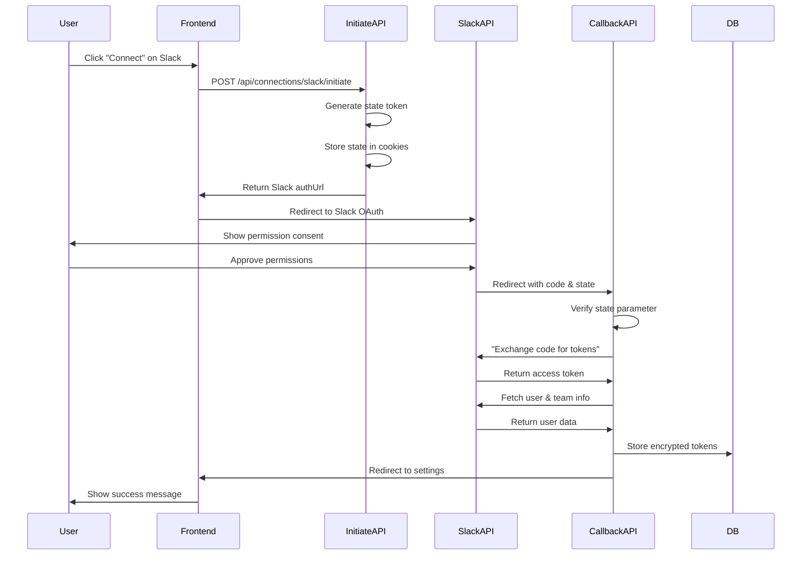

# Slack OAuth Connection Implementation

## Overview

Implement Slack OAuth integration following a separate architecture from Google OAuth, with dedicated API routes and client module for Slack's OAuth 2.0 flow.

## Architecture

## Implementation Steps

### 1. Environment Configuration

Add to `.env` file:

- `SLACK_CLIENT_ID` - From Slack App settings
- `SLACK_CLIENT_SECRET` - From Slack App settings
- Ensure `ENCRYPTION_KEY` exists for token encryption

### 2. Create Slack OAuth Client Module

Create [`src/lib/connections/slack-client.ts`](src/lib/connections/slack-client.ts):

- Define Slack scopes: `channels:read`, `channels:history`
- Build OAuth authorization URL with user identity scopes
- Exchange authorization code for access token
- Fetch user identity (user ID, email)
- Fetch team/workspace info (team ID, team name)
- Revoke access token when disconnecting
- Scope verification utility

**Key differences from Google:**

- Slack uses different OAuth endpoint structure
- No refresh tokens by default (tokens don't expire unless manually revoked)
- Need to fetch both user identity AND team info
- Combine team ID + user ID for `providerAccountId`

### 3. Create Slack Initiate API Route

Create [`src/app/api/connections/slack/initiate/route.ts`](src/app/api/connections/slack/initiate/route.ts):

- Verify user authentication
- Generate secure state parameter (32-byte random hex)
- Store state, provider ('slack'), and scopes in httpOnly cookies (10-minute expiry)
- Build Slack authorization URL using slack-client
- Return authorization URL to frontend

### 4. Create Slack Callback API Route

Create [`src/app/api/connections/slack/callback/route.ts`](src/app/api/connections/slack/callback/route.ts):

- Handle OAuth callback with code and state parameters
- Verify state parameter against stored cookie
- Exchange authorization code for access token
- Verify granted scopes match requested scopes
- Fetch user identity and team information
- Create `providerAccountId` as `{teamId}-{userId}` format
- Encrypt access token using existing encryption utilities
- Store connection in database via `upsertConnection`
- Clear OAuth cookies and redirect to settings page

### 5. Create Slack Status API Route

Create [`src/app/api/connections/slack/route.ts`](src/app/api/connections/slack/route.ts):

- **GET**: Check connection status, return `{ connected: boolean, email?: string, team?: string }`
- **DELETE**: Disconnect Slack, revoke token with Slack API, soft-delete from database

### 6. Update Frontend Components

Update [`src/components/connections-card.tsx`](src/components/connections-card.tsx):

- Change Slack `comingSoon: true` to `comingSoon: false`
- Update description if needed
- Frontend already supports the provider-agnostic API pattern

### 7. Update Type Definitions & Validation

- Update Provider types if needed to support non-Google providers
- Ensure database schema supports Slack connections (already generic)

### 8. Token Management for Slack

Note: Slack tokens typically don't expire, but we should:

- Store `accessTokenExpiresAt` as `null` since Slack doesn't provide expiry
- Handle token revocation on disconnect
- Consider adding token validation endpoint for future health checks

## File Changes Summary

**New Files:**

- `src/lib/connections/slack-client.ts` - Slack OAuth client and utilities
- `src/app/api/connections/slack/initiate/route.ts` - Initiate OAuth flow
- `src/app/api/connections/slack/callback/route.ts` - Handle OAuth callback
- `src/app/api/connections/slack/route.ts` - Status check and disconnect

**Modified Files:**

- `src/components/connections-card.tsx` - Enable Slack connection (remove `comingSoon` flag)

## Testing Checklist

1. Create Slack App at api.slack.com/apps
2. Configure OAuth redirect URL: `{BASE_URL}/api/connections/slack/callback`
3. Enable required scopes in Slack App settings
4. Test initiate flow → Slack consent screen
5. Test callback → successful token exchange
6. Verify encrypted token storage in database
7. Test status API returns correct connection state
8. Test disconnect flow and token revocation
9. Test scope mismatch error handling
10. Test state parameter validation

## Security Considerations

- State parameter prevents CSRF attacks
- Tokens encrypted at rest using AES-256-GCM
- httpOnly cookies for OAuth state storage
- Scope verification ensures user granted all required permissions