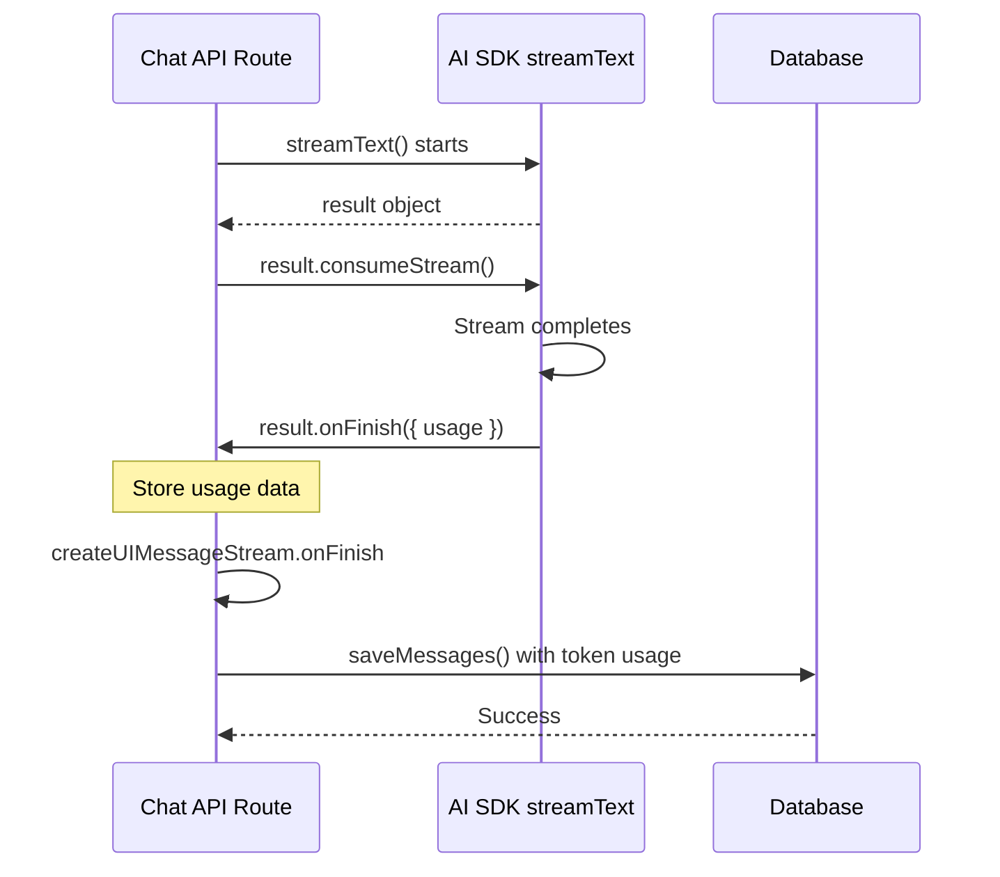

# Track Token Usage in Database

## Overview

Implement token usage tracking for AI chat messages by:

1. Extending the database schema to store token metrics per message
2. Capturing usage data from the AI SDK's `streamText` result
3. Storing token usage in the database after each AI response completes

## Implementation Steps

### 1. Update Database Schema

**File: [`src/db/schemas/message.ts`](src/db/schemas/message.ts)**Add three new integer columns to the `message` table:

- `inputTokens` - tokens in the prompt
- `outputTokens` - tokens in the completion
- `totalTokens` - total tokens used

These will be nullable since user messages won't have token usage data.

### 2. Create Database Migration

Generate a new Drizzle migration to add the token usage columns to the existing `message` table using the Drizzle Kit CLI.

### 3. Update Message Queries

**File: [`src/db/queries/message.ts`](src/db/queries/message.ts)**

- Update the `saveMessages` function signature to accept optional token usage fields
- Update the `DBMessage` type to include the new token fields

### 4. Capture Token Usage in Chat API

**File: [`src/app/api/chat/route.ts`](src/app/api/chat/route.ts)**Currently using `createUIMessageStream` with `onFinish` callback at line 210. The implementation will:

1. Access the `streamText` result object (currently at line 163)
2. Add an `onFinish` callback to the `streamText` call to capture usage data
3. Store the usage data in a variable accessible to the outer `createUIMessageStream.onFinish` callback
4. When saving AI messages in the outer `onFinish` (lines 237-248), include the token usage data

**Key integration points:**

- Use the `result.onFinish` callback from `streamText` (as shown in the AI SDK docs)
- The callback receives `{ usage }` with `{ inputTokens, outputTokens, totalTokens }`
- Pass this data when calling `saveMessages` for assistant messages

### 5. Migration Flow

## Files to Modify

- [`src/db/schemas/message.ts`](src/db/schemas/message.ts) - Add token columns
- [`src/db/queries/message.ts`](src/db/queries/message.ts) - Update types and queries
- [`src/app/api/chat/route.ts`](src/app/api/chat/route.ts) - Capture and save usage data
- New migration file in `src/db/migrations/` - Add columns to message table

## Technical Notes

- The AI SDK's `streamText` returns a result with a `usage` promise that resolves after streaming completes
- According to the [AI SDK docs](https://ai-sdk.dev/cookbook/node/stream-object-record-token-usage), you can use either `onFinish` callback or the `usage` promise
- Using `onFinish` callback is more suitable here since we already have callback-based flow
- Only assistant/AI messages will have token usage; user messages will have NULL values